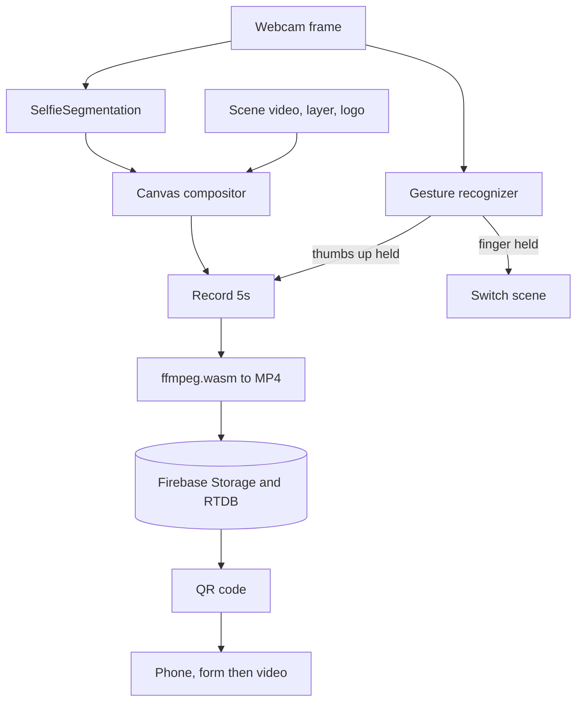

# Epic Mirror

An interactive "magic mirror" installation. You stand in front of a camera totem, it cuts you out of your background in real time and drops you into an animated scene, you control it with hand gestures, and it hands you a short video of the result by QR code. The repo was renamed from sigmaAgro, which is the brand it was built for, an agritech company, so the scenes and copy are theirs.

## What it is

This is the software behind a physical booth. A tall vertical screen shows a live, composited view of the visitor: the camera feed with the background replaced by a looping branded scene (a countryside, an interview set), a foreground layer, and a logo, all stacked on one canvas at 1080 by 1920. There is no keyboard and no touch. You control it with your hands, and you leave with a shareable clip.

## What it does

- Real-time background replacement from a webcam, no green screen needed
- Hand-gesture control: hold a thumbs-up to start recording, hold a pointing finger to switch scenes
- A dwell-to-confirm UI where each gesture charges a radial meter over 1.5 seconds, so nothing fires by accident
- Records a 5-second clip of the composited canvas, transcodes it to MP4 in the browser, and uploads it
- Shows a QR code that opens the clip on the visitor's phone, behind a short email and phone form
- On the phone, share the video through the native share sheet or download it

## How it works

Everything runs client-side in the browser. Two MediaPipe models read the same webcam frame each tick: SelfieSegmentation for the person mask, and the tasks-vision GestureRecognizer for the hands.



### The compositor

The person-in-a-scene effect is done with canvas composite operations, not a shader. Each frame draws the segmentation mask, switches to `source-in` so the next draw (the raw camera image) only survives where the mask is, then `destination-over` to slide the background video behind it, then `source-over` for the foreground layer and logo on top. Segmentation and gesture recognition fire together with `Promise.all` against the same video element, so the mask and the hand read stay in sync on one frame. It is a lot of state to hold in one component, but keeping the whole pipeline on the canvas is what lets it run in a plain browser with no server in the loop.

### In-browser transcode

The capture is deliberately a two-format process. The canvas stream is recorded with MediaRecorder as WebM (VP9 and Opus), then ffmpeg.wasm transcodes it to H.264 MP4 (ultrafast, scaled to 640, 15 fps, faststart) right there in the browser before upload. The reason is the handoff: WebM does not play or share cleanly on iOS, and this booth gives its output to whatever phone the visitor is holding. Transcoding on the client costs a few seconds and a wasm download, but it means the file behind the QR code just works in an iPhone share sheet, which is the whole point of the installation. A 40-second timeout wraps the conversion so a stuck encode never hangs the booth.

### Gesture dwell

Small but important for a public kiosk: gestures do not trigger on sight. Holding a thumbs-up or a pointing finger fills a radial meter over 1.5 seconds (a `setInterval` steps the fill, a `setTimeout` fires the action), and letting go resets it. In a booth where people wave their hands around, the dwell window is what separates "I meant that" from noise.

## Tech stack

- Frontend: React 18, Vite, Tailwind CSS, React Router
- Vision: MediaPipe SelfieSegmentation and tasks-vision GestureRecognizer, TensorFlow.js WebGL backend
- Media: MediaRecorder, ffmpeg.wasm, Web Share API, file-saver
- Backend: Firebase Storage and Realtime Database
- Hosting: Firebase Hosting, deployed from GitHub Actions

The visitor-facing copy is in Spanish.

## Routes

- `/totem`: the booth screen (segmentation, gestures, recording)
- `/video/:id`: the phone page (lead form, then the shareable video)

## Running it

```bash
npm install
npm run dev
```

Needs a Firebase project (Storage and Realtime Database) configured in `src/Utils/firebase.js`. A camera and a WebGL-capable browser are required.

## Status

A portfolio interactive installation, built for the SigmaAgro brand. There is a Vite plugin shim in `src/Utils/mediapipe-workaround.js` that fixes MediaPipe's module exports at build time, which is a known rough edge of bundling those packages.
