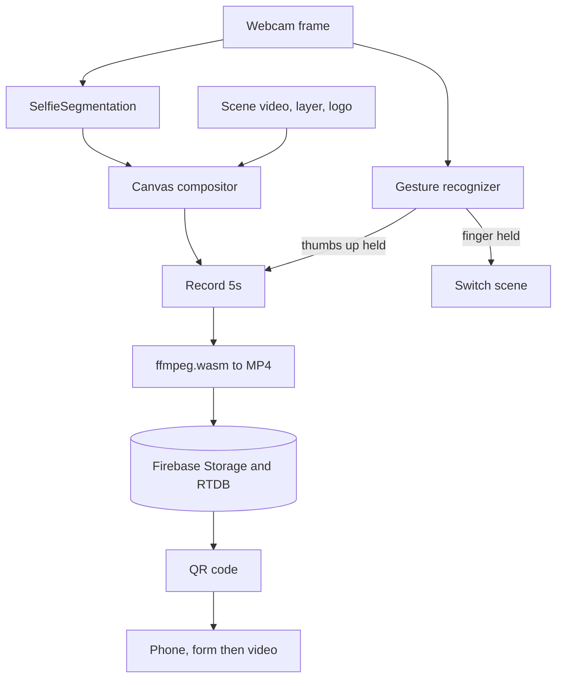

# Epic Mirror

An interactive "magic mirror" installation. You stand in front of a camera totem. It cuts you out of your background in real time, drops you into an animated scene, and lets you drive the whole thing with hand gestures. When you finish, it hands you a short video by QR code. I built it for SigmaAgro, an agritech brand, so the scenes and copy are theirs.

## What it is

This is the software behind a physical booth. A tall vertical screen shows a live, composited view of the visitor: the camera feed with the background swapped for a looping branded scene (a countryside, an interview set), plus a foreground layer and a logo. It all stacks on one canvas at 1080 by 1920. No keyboard, no touch. You control it with your hands and walk away with a shareable clip.

## What it does

- Real-time background replacement from a webcam, no green screen needed
- Hand-gesture control: hold a thumbs-up to start recording, hold a pointing finger to switch scenes
- A dwell-to-confirm UI, so a passing gesture never fires by accident
- Records a 5-second clip of the composited canvas, transcodes it to MP4 in the browser, and uploads it
- Shows a QR code that opens the clip on the visitor's phone, behind a short email and phone form
- On the phone, share the video through the native share sheet or download it

## How it works

Everything runs client-side in the browser. Two MediaPipe models read the same webcam frame each tick: SelfieSegmentation for the person mask, and the tasks-vision GestureRecognizer for the hands.



### The compositor

The person-in-a-scene effect comes straight from canvas composite operations. Each frame draws the segmentation mask, then switches to `source-in` so the raw camera image only survives where the mask is. Next, `destination-over` slides the background video behind it. Then `source-over` lays the foreground layer and logo on top. Segmentation and gesture recognition fire together with `Promise.all` against the same video element, so the mask and the hand read stay in sync on a single frame. It is a lot of state for one component, but keeping the whole pipeline on the canvas is what lets it run in a plain browser with nothing on the server.

### In-browser transcode

The recording happens in two formats on purpose. MediaRecorder captures the canvas stream as WebM (VP9 and Opus). Then ffmpeg.wasm transcodes it to H.264 MP4 right in the browser before upload (ultrafast, scaled to 640, 15 fps, faststart). Here is why. WebM does not play or share cleanly on iOS, and the booth hands its output to whatever phone the visitor is holding. The transcode costs a few seconds and a wasm download, but the file behind the QR code then just works in an iPhone share sheet. A 40-second timeout wraps the conversion, so a stuck encode never hangs the booth.

### Gesture dwell

For a public kiosk, a gesture has to be deliberate. Hold a thumbs-up or a pointing finger and a radial meter fills over 1.5 seconds (a `setInterval` steps the fill, a `setTimeout` fires the action). Let go and it resets. Nothing triggers on sight, so in a booth full of people waving their hands, that dwell window separates "I meant that" from noise.

## Tech stack

- Frontend: React 18, Vite, Tailwind CSS, React Router
- Vision: MediaPipe SelfieSegmentation and tasks-vision GestureRecognizer, TensorFlow.js WebGL backend
- Media: MediaRecorder, ffmpeg.wasm, Web Share API, file-saver
- Backend: Firebase Storage and Realtime Database
- Hosting: Firebase Hosting, deployed from GitHub Actions

The visitor-facing copy is in Spanish.

## Routes

- `/totem`: the booth screen (segmentation, gestures, recording)
- `/video/:id`: the phone page (lead form, then the shareable video)

## Running it

```bash
npm install
npm run dev
```

Needs a Firebase project (Storage and Realtime Database) configured in `src/Utils/firebase.js`. A camera and a WebGL-capable browser are required.

## Status

An interactive installation built for the SigmaAgro brand. One rough edge worth flagging: there is a Vite plugin shim in `src/Utils/mediapipe-workaround.js` that patches MediaPipe's module exports at build time, a known pain when bundling those packages.
